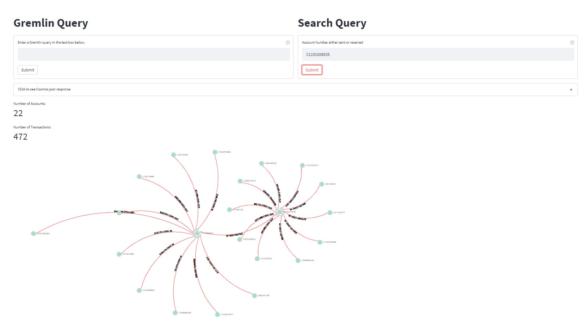

# Blog post

## Problem statement

Bank transactions have traditionally been stored in transactional databases and analysed using SQL queries and to increase scale they are now analysed in distributed systems using Apache Spark. While SQL is great to analyse this data finding relationships between transactions and accounts can be challenging. In this scenario we want to visualize 2 level of customer relationships i.e. if A sends to B and B send to C then we want to identify C when we look at transactions made by A together with C and vice versa.

## Why does this solution solve the problem

Graph helps solve **complex** problems by utilizing power of **relationships** between objects, some of these can be modeled as SQL statements gremlin api provide a more concise way to express and search relationships. In this solution we are using Azure Cosmos Graph DB to store transactions data with customer account id as vertices and transaction as edges and transactional amount as properties of the edges. Running fan out queries on Cosmos is not ideal so Azure search is used to automatically index edge data and perform full scan queries on the index. Azure search will give us the flexibility to search for account either received or sent and we can use the associated accounts to find all other connected accounts using gremlin api. This provides a scalable solution that can scale for any number of transactions.


1. Infrastructure:
   1. Bicep code is included with this repository and will deploy Cosmos DB, Synapse Spark pool and Azure Search service and follow the below steps
   2. update `param.dev.json` file based on your requirements
   3. change `clientIp` to your workstation ip ( Default value `0.0.0.0`)
   4. change `sqlAdminPassword` to a strong password ( Default value `**ChangeMeNow1234!**`)
   5. run below command to create cosmosdb database and collection

- `az login`
- `az deployment sub create --location southeastasia --template-file infra/main.bicep --parameters infra/params.dev.json`

2. Data source: [Kaggle Fraud Transaction Detection](https://www.kaggle.com/llabhishekll/fraud-transaction-detection/data). A copy of this data is available in this repo at [PS_20174392719_1491204439457_log.csv](load_data/data/PS_20174392719_1491204439457_log.csv) ( NOTE: you need to use [git-lfs](https://git-lfs.github.com/) to download the csv file locally )

3. Data ingestion using PySpark

   1. Create Synapse spark medium pool in Synapse. [Link](https://docs.microsoft.com/en-us/azure/synapse-analytics/quickstart-create-apache-spark-pool-portal)
   2. Upload csv file downloaded from previous step into Synapse linked storage account
   3. create linked service to mount the storage account e.g. `linked-storage-service`
   4. Import notebook ["`insert_transact_data_spark.ipynb`"](load_data/insert_transact_data_spark.ipynb)
   5. Update `linkedService` , `cosmosEndpoint`, `cosmosMasterKey`, `cosmosDatabaseName` and `cosmosContainerName` in notebook
   6. run notebook
   7. monitor the progress of data load from Cosmos DB insights view ( NOTE: Cosmos billing is per hour so adjust your RU's accordingly to minimize cost)

4. Azure search Cosmos index creation

   1. Cosmos DB Gremlin data is stored in json and available using SQL api as well, follow this [reference](https://docs.microsoft.com/en-us/azure/search/search-howto-index-cosmosdb) on how to create index on Cosmos DB Gremlin data

5. Visualize data

   1. Sample dashboard app based on [streamlit](https://github.com/streamlit/streamlit) is available [here](visualize/dashboard.py)
   2. To run the app

      1. Install dependencies from [requirements.txt](./requirements.txt)
      2. create `.env` files with

      - `COSMOS_DATABASE`, `COSMOS_GRAPH_COLLECTION`, `COSMOS_KEY` and `COSMOS_ENDPOINT` from Cosmos DB account
      - `SEARCH_KEY`, `SEARCH_INDEX` and `SEARCH_ENDPOINT` from Search service
      <details>
      <summary>.env file example (replace with values from your services)</summary>

      ```bash
      COSMOS_DATABASE=database01
      COSMOS_GRAPH_COLLECTION=graph01
      COSMOS_KEY=xxxxx
      COSMOS_ENDPOINT=xxxxx.gremlin.cosmos.azure.com:443/
      SEARCH_KEY=xxxx
      SEARCH_INDEX=cosmosdb-index
      SEARCH_ENDPOINT=https://xxxxx.search.windows.net
      ```

      </details>

      3. run `streamlit run visualize/dashboard.py`

      

## Key highlights:

1. Synapse spark is used to bulk load data into gremlin using SQL api NOTE: Cosmos gremlin expects to have certain json fields in the edge properties. Since cosmos billing is charged per hour we need to adjust the RU's accordingly to minimize cost, a spark cluster with 4 nodes and cosmos throughput at 20,000 RU/s ( single region) both edges (9 Million ) and vertices (6 Million) records can be ingested in an hour.
2. All search fan-out queries are done using Azure cognitive search api, Cosmos indexer can be scheduled at regular intervals to update the index
3. Only accounts that are connected to the transaction are returned from search to narrow down the search results when executing gremlin query and the gremlin query executed is `g.V().has('accountId',within({vertices_list})).optional(both().both()).bothE().as('e').inV().as('v').select('e', 'v')` you can customize this query based on your use-case

## Next steps

Clone this repo [cosmosdb-graph-demo](https://github.com/lordlinus/cosmosdb-graph-demo) update configurations and run dashboard app with the data loaded
